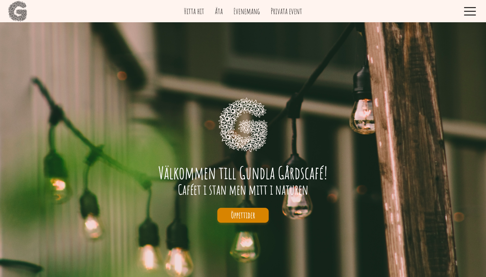
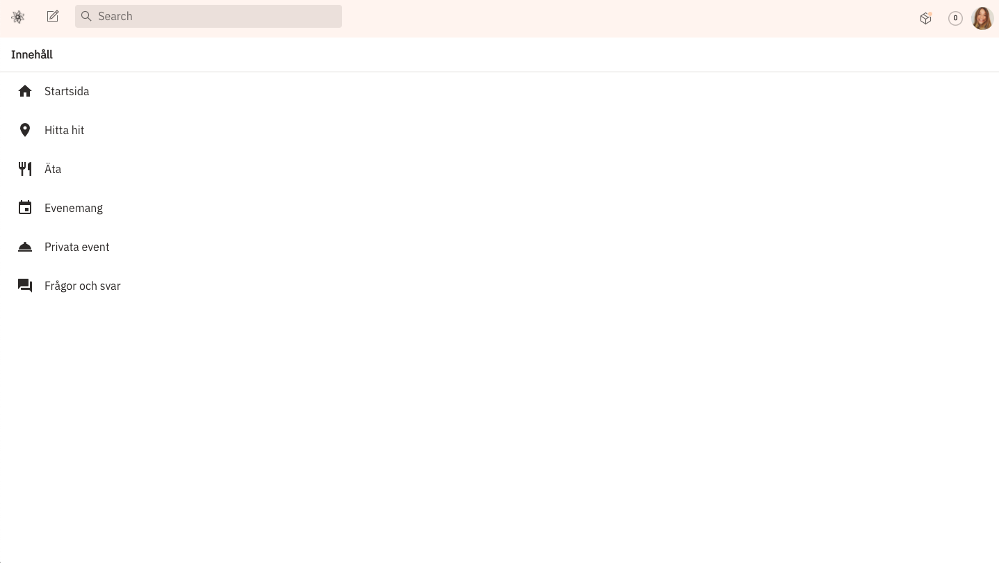

# Homepage for Gundla Gårdscafé




This is a website made for Gundla Gårdscafé that is build with Next.js and connected to Sanity as headless CMS.

## Link 

https://gundlagardscafe.vercel.app/

## Installation
- Clone the repository
```
$ git clone https://github.com/juljulia/gundlagardscafe
```
- In the web directory, run: 
```
$ npm run dev
```
- Open http://localhost:3000 to view the webpage in the browser.

## Authors
- **Julia Karlsson** - *Initial work* - [Julia](https://Juljulia.github.io)
- **Maja Alin** - *Initial work* - [Maja](https://majaalin.github.io)

## License
This project is licensed under the MIT License.